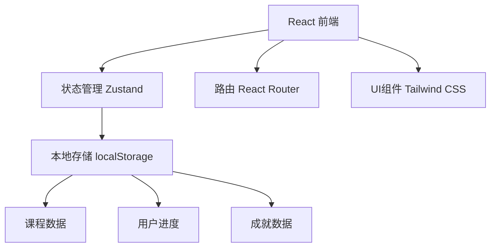

## 1. Architecture Design


## 2. Technology Description
- 前端：React@18 + TypeScript + tailwindcss@3 + vite
- 状态管理：zustand
- 路由：react-router-dom
- 部署：Cloudflare Pages

## 3. Route Definitions
| Route | Purpose |
|-------|---------|
| / | 首页 |
| /courses | 课程体系 |
| /courses/:id | 课程详情 |
| /learn/:courseId/:chapterId | 学习模块 |
| /quiz/:courseId | 测评系统 |
| /achievements | 成就系统 |
| /profile | 个人中心 |

## 4. Data Model
### 4.1 数据类型定义

```typescript
// 课程类型
interface Course {
  id: string;
  title: string;
  description: string;
  category: string;
  difficulty: 'beginner' | 'intermediate' | 'advanced';
  chapters: Chapter[];
  thumbnail: string;
  estimatedHours: number;
}

// 章节类型
interface Chapter {
  id: string;
  title: string;
  content: string;
  exercises: Exercise[];
  quiz: QuizQuestion[];
}

// 练习类型
interface Exercise {
  id: string;
  type: 'multiple-choice' | 'coding' | 'matching';
  question: string;
  options?: string[];
  correctAnswer: string | string[];
  explanation: string;
}

// 测评题目类型
interface QuizQuestion {
  id: string;
  type: 'multiple-choice' | 'true-false' | 'short-answer';
  question: string;
  options?: string[];
  correctAnswer: string | string[];
  points: number;
}

// 成就类型
interface Achievement {
  id: string;
  title: string;
  description: string;
  icon: string;
  unlocked: boolean;
  unlockedAt?: Date;
}

// 用户进度类型
interface UserProgress {
  courseId: string;
  completedChapters: string[];
  completedExercises: string[];
  quizScores: { [quizId: string]: number };
  achievements: string[];
}
```

### 4.2 初始数据
- 预定义商务数据分析课程内容
- 成就系统数据
- 练习和测评题目
