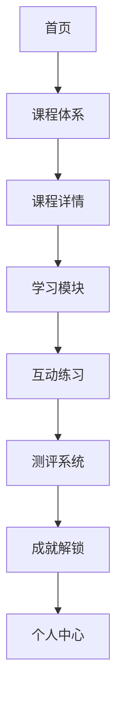

## 1. Product Overview
一款面向商务数据分析与应用专业的在线教育平台，提供完整的课程体系、互动式学习模块、练习测评和成就激励系统。

## 2. Core Features

### 2.1 User Roles
| Role | Registration Method | Core Permissions |
|------|---------------------|------------------|
| 学生用户 | 邮箱/用户名注册 | 浏览课程、学习课程内容、完成练习、参加测评、查看成就 |

### 2.2 Feature Module
1. **首页**：平台介绍、课程导航、用户进度概览、成就展示
2. **课程体系**：课程列表、课程详情、学习路径规划
3. **学习模块**：课程内容学习、互动练习
4. **测评系统**：单元测试、综合测评、成绩记录
5. **成就系统**：成就展示、成就解锁、进度追踪
6. **个人中心**：学习进度、成绩记录、成就列表

### 2.3 Page Details
| Page Name | Module Name | Feature description |
|-----------|-------------|---------------------|
| 首页 | Hero区域 | 平台特色介绍、CTA按钮、动画效果 |
| 首页 | 课程概览 | 热门课程推荐、学习进度卡片 |
| 首页 | 成就展示 | 最新成就解锁、进度条 |
| 课程体系 | 课程列表 | 课程分类筛选、课程卡片展示 |
| 课程体系 | 课程详情 | 课程介绍、学习大纲、学习进度 |
| 学习模块 | 内容学习 | 章节导航、内容展示、互动练习 |
| 测评系统 | 测试页面 | 题目展示、答题交互、成绩反馈 |
| 成就系统 | 成就展示 | 成就列表、成就详情、进度追踪 |
| 个人中心 | 学习记录 | 学习进度、成绩历史、成就统计 |

## 3. Core Process
用户访问平台 → 浏览课程体系 → 选择课程学习 → 完成课程内容和互动练习 → 参加单元测试 → 解锁成就 → 继续下一课程

## 4. User Interface Design
### 4.1 Design Style
- 主色调：蓝色系（#2563eb），代表专业和信任
- 辅助色：橙色（#f97316），代表活力和成就
- 按钮风格：圆角矩形，悬停动画
- 字体：现代无衬线字体，清晰易读
- 布局风格：卡片式布局，清晰的层级结构
- 图标风格：简约线性图标，搭配emoji

### 4.2 Page Design Overview
| Page Name | Module Name | UI Elements |
|-----------|-------------|-------------|
| 首页 | Hero区域 | 渐变背景、动画标题、圆角按钮、卡片式内容展示 |
| 课程体系 | 课程列表 | 分类标签、课程卡片、进度条、hover效果 |
| 学习模块 | 内容学习 | 侧边栏导航、内容区域、练习卡片 |
| 成就系统 | 成就展示 | 徽章展示、解锁动画、进度条、成就详情弹窗 |

### 4.3 Responsiveness
- 桌面优先设计，自适应平板和移动设备
- 触摸交互优化

